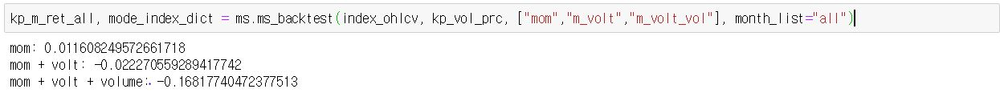
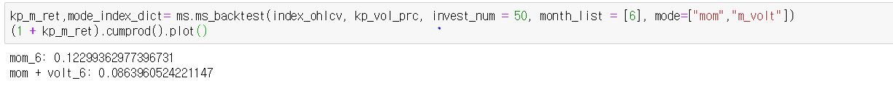
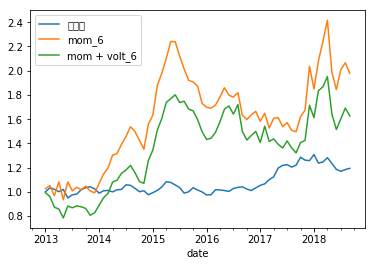
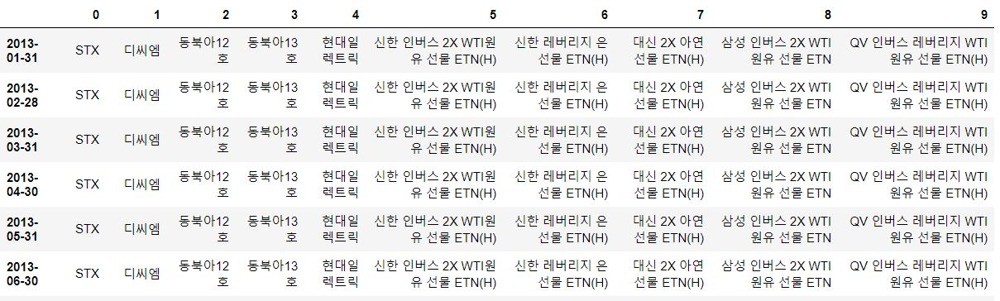

# KeystQunat backtest modul 사용법

+ 이 문서는 buzzz의 알고리즘을 테스트하는 keystQuant Backtest Module 사용법입니다.

## 1. 기능
keystQuant Backtest Module은 5가지 기능을 가지고 있습니다.

### 1. Market Signal

+ 시장의 전체 상황을 분석하여 매도 매수 시그널을 발생시키는 툴입니다.

+ package load는 다음과 같습니다.

```python
from module import market_signal
from module.market_signal import MarketSignal
%matplotlib inlinemd_img/index_ohlcv.jpg

import matplotlib.pyplot as plt
ms = MarketSignal()
```
#### 1. merge_index_data()

+ bm(코스피, 코스닥), style(가치주, 성장주, 배당주, 퀄리티주, 사회책임경영주), size, indusrty별로 모든 종가데이터와 거래량 데이터를 합친 데이터 프레임을 생성합니다.

```python
#### 2.  make_ohlcv_df(index_ohlcv, index_vol)

+ make_ohlcv_df는 backtesting에 필요한 각종 dataframe을 만드는 함수입니다. 
+ 들어가는 argument로는 1. 에서 생성한 index_ohlcv, index_ohlcv입니다.

```python
kp_vol_prc, kd_vol_prc, index_vol_prc, kp_ret, kd_ret, index_ret, ohlcv, volume, vol_prc, returns = ms.make_ohlcv_df(index_ohlcv, index_vol)
```
+ return 되는 데이터는
 
	- kp_vol_prc, kd_vol_prc, index_vol_prc : 코스피(모든 종목), 코스닥(모든 종목), 지수별 총 거래금액 데이터 
	- kp_ret, kd_ret, index_ret : 코스피(모든 종목), 코스닥(모든 종목), 지수별 수익률 데이터 만들기
	- ohlcv, volume, vol_prc, returns : 코스피(모든 종목), 코스닥(모든 종목), 지수별  OHLCV, Volume, Return 데이터를 하나로 묶는다

#### 3. ms_backtest(self, index_ohlcv, vol_prc, mode, invest_num=10, month_list="all", market = "코스피", period="M", rolling=200)
<br/>


+ index_ohlcv, volume price 데이터를 넣어주어야 한다.

+ mode는 list를 넣어야하고 momentum, momentum + volatility, momentum + volatility + volume_price를 볼지 정할 수 있다.
	ex) momentum만 보고 싶으면 ["mom"], momentum과  momentum + volatility를 보고싶으면 ["mom", "m_volt"]를 넣으면 된다.
    ex)  momentum = ["mom"], momentum + volatility = ["m_volt"], momentum + volatility + volume_price = ["mom_volt_vol"]
+ month_list 는 몇 개월 수익률을 볼지 사용자가 정할 수 있다.
 - "all" : 1개월 ~ 12개월 모멘텀의 평균 수익률을 구해서 개산
 - "acceler": 1, 3, 6개월 평균 모멘텀을 설정할 수 도 있다. accelerating mome
 - 사용자가 지정하는 momentum 수익률을 볼 수 있다.
	ex) 예를 들어서 1개월 3개월을 사용하고 싶으면 month_list = [1,3]을 입력할 수 있다.
 - invest_num : total_rank가 높은 몇번째 종목까지 투자할지 정할 수 있다. invest_num이 10이면 total_rank가 높은 10종목에 투자한다는 말이다.
 -  rolling = 변동성의 이동평균의 기준을 정하는 인자이다. 보통 1년 이동평균을 구하므로 200이 기본 설정으로 되어 있다.
 -  period = 시계열 데이터를 어떤식으로 resample할지 정하는 인자이다. 보통 월단위로 resample 하므로 "M"이 default 값이다.

#### 듀얼 모멘텀(1개월 ~ 12개월 평균)

```python
kp_m_ret_all, mode_index_dict = ms.ms_backtest(index_ohlcv, kp_vol_prc, ["mom","m_volt","m_volt_vol"], month_list="all")
```
<p align="center"></p>


#### 듀얼 모멘텀(사용자 지정)
```python
kp_m_ret,mode_index_dict= ms.ms_backtest(index_ohlcv, kp_vol_prc, invest_num = 50, month_list = [6], mode=["mom","m_volt"])
(1 + kp_m_ret).cumprod().plot()
```
<p align="center"></p>
<p align="center"></p>

```python
kp_m_ret,mode_index_dict= ms.ms_backtest(index_ohlcv, kp_vol_prc, invest_num = 50, month_list = [6], mode=["mom","m_volt"])
(1 + kp_m_ret).cumprod().plot()
```


```python
import pandas as pd
data = mode_index_dict['m_volt']
df1 = pd.DataFrame.from_dict(data, orient='index')
df1
```
<p align="center"></p>

### 2. Risk Management
### 3. Defacto(수급분석)
### 4. Data Crawler(수동)
### 5. Send Cache
