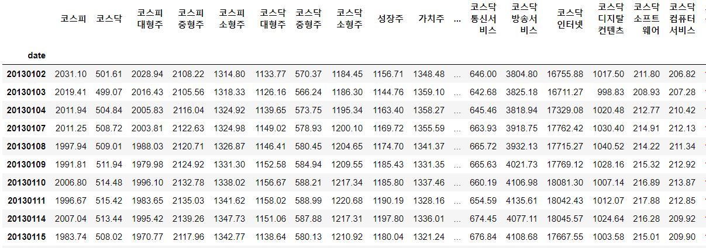

# KeystQunat backtest modul 사용법

+ 이 문서는 buzzz의 알고리즘을 테스트하는 keystQuant Backtest Module 사용법입니다.

## 1. 기능
keystQuant Backtest Module은 5가지 기능을 가지고 있습니다.

### 1. Market Signal

+ 시장의 전체 상황을 분석하여 매도 매수 시그널을 발생시키는 툴입니다.

+ package load는 다음과 같습니다.

```python
from module import market_signal
from module.market_signal import MarketSignal
%matplotlib inlinemd_img/index_ohlcv.jpg

import matplotlib.pyplot as plt
ms = MarketSignal()
```
#### 1. merge_index_data()

+ bm(코스피, 코스닥), style(가치주, 성장주, 배당주, 퀄리티주, 사회책임경영주), size, indusrty별로 모든 종가데이터와 거래량 데이터를 합친 데이터 프레임을 생성합니다.

```python
index_ohlcv, index_vol = ms.merge_index_data()
```
<p align="center"></p>

#### 2.  make_ohlcv_df(index_ohlcv, index_vol)

+ make_ohlcv_df는 backtesting에 필요한 각종 dataframe을 만드는 함수입니다. 
+ 들어가는 argument로는 1. 에서 생성한 index_ohlcv, index_ohlcv입니다.

```python
kp_vol_prc, kd_vol_prc, index_vol_prc, kp_ret, kd_ret, index_ret, ohlcv, volume, vol_prc, returns = ms.make_ohlcv_df(index_ohlcv, index_vol)
```
+ return 되는 데이터는
 
	- kp_vol_prc, kd_vol_prc, index_vol_prc : 코스피(모든 종목), 코스닥(모든 종목), 지수별 총 거래금액 데이터 
	- kp_ret, kd_ret, index_ret : 코스피(모든 종목), 코스닥(모든 종목), 지수별 수익률 데이터 만들기
	- ohlcv, volume, vol_prc, returns : 코스피(모든 종목), 코스닥(모든 종목), 지수별  OHLCV, Volume, Return 데이터를 하나로 묶는다

#### 3. ms_backtest(self, index_ohlcv, vol_prc, mode, invest_num=10, month_list="all", market = "코스피", period="M", rolling=200)
<br/>
##### 평균 듀얼 모멘텀

```python
kp_m_reta_all, mode_index_dict = ms.ms_backtest(index_ohlcv, kp_vol_prc, ["mom","m_volt","m_volt_vol"], month_list="all")
```

### 2. Risk Management
### 3. Defacto(수급분석)
### 4. Data Crawler(수동)
### 5. Send Cache
